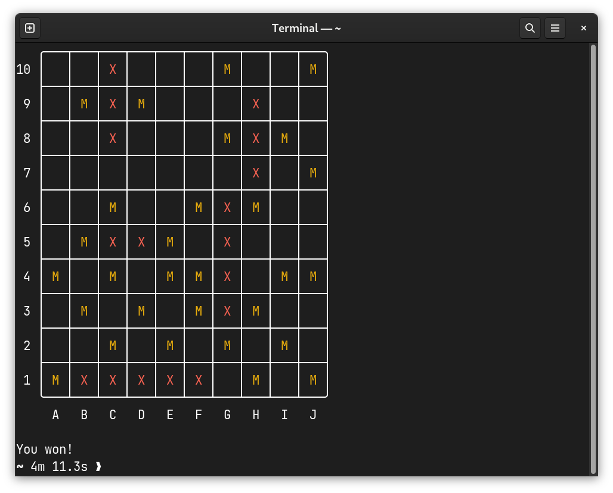

# Battleships

A one sided game of battleships in your terminal! 



## Installation

To install battleships with cargo, use the following command:

```
cargo install --git https://github.com/danielronalds/battleships.git 
```
**NOTE** Only tested on Fedora 37 Workstation Edition

## How to play

To start a game of battleships, just run `battleships`

The computer randomly places the following ships around the 10x10 grid

| Ship | Length |
| ---- | ------ |
| Carrier | 5 |
| Battleship | 4 |
| Cruiser | 3 |
| Submarine | 3 |
| Destroyer | 2 |

You, as the player, must guess where all these ships are on the grid and sink 
all of them to win. Your guess's must be in the format (Column Letter)(Row Number), 
eg: A2, B7, F4. To guess simply type the coordinates of the grid you'd 
like to hit and press enter. A letter will then appear at those coordinates, a 
yellow M for a miss, and a red X for a hit. Incorrectly formatted guesses will 
not be accepted, as well as guesses that are not valid as their letter or number 
is out of range of the grid, eg: A11. The game ends when you have sunk all of 
the computer's ships.


## CLI Options

#### Displaying the location of the ships

Running the game with the `--show-ships` flag will print the board displaying 
all of the enemy ships. Although I'm not quite sure why you'd want to do this, 
I found it super helpful for debugging and why remove a feature that doesn't 
break anything.
